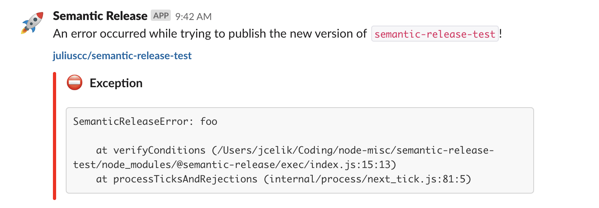

# semantic-release-slack-bot

[**semantic-release**](https://github.com/semantic-release/semantic-release) plugin to get release notifications on [slack](https://slack.com/) from a slack bot

[](https://www.npmjs.com/package/semantic-release-slack-bot)
[](https://www.npmjs.com/package/semantic-release-slack-bot)
[](https://circleci.com/gh/juliuscc/semantic-release-slack-bot)
[](https://github.com/juliuscc/semantic-release-slack-bot/blob/master/LICENSE)
[](https://slack.com/oauth/authorize?client_id=605439709265.611687593109&scope=incoming-webhook)

| Step      | Description                                         |
| --------- | --------------------------------------------------- |
| `success` | Send a slack message to notify of a new release.    |
| `fail`    | Send a slack message to notify of a failed release. |

## Install

Add the plugin to your npm-project:

```bash
$ npm install semantic-release-slack-bot -D
```

The corresponding slack app has to be installed in your slack workspace as well. Follow the instructions under [configuration](#configuration) for more information.

## Usage

The plugin can be configured in the [**semantic-release** configuration file](https://github.com/semantic-release/semantic-release/blob/master/docs/usage/configuration.md#configuration):

```json
{
  "plugins": [
    "@semantic-release/commit-analyzer",
    "@semantic-release/release-notes-generator",
    [
      "semantic-release-slack-bot",
      {
        "notifyOnSuccess": false,
        "notifyOnFail": true
      }
    ]
  ]
}
```

With this example:

- Slack notifications are skipped on a successful release
- Slack notifications are sent on a failed release

## Screenshots




## Configuration

### Slack app installation

The plugin uses a slack webhook which you get by adding the slack app to your slack workspace. Register the app using the button below or [this link](https://slack.com/oauth/authorize?client_id=605439709265.611687593109&scope=incoming-webhook).

<a href="https://slack.com/oauth/authorize?client_id=605439709265.611687593109&scope=incoming-webhook"></a>

For the security concerned, feel free to [create your own slack app](https://api.slack.com/apps) and create a webhook or inspect the server code that does this creation for you at [create-webhook.js](lambda/create-webhook.js). The only required permission for the webhook is to publish to a single channel.

### Slack app authentication

Installing the app will yield you with a webhook that the app uses to publish updates to your selected channel. The Slack webhook authentication link is **required and needs to be kept a secret**. It should be defined in the [environment variables](#environment-variables).

### Environment variables

The `SLACK_WEBHOOK` variable can be defined in the environment where you will run semantic release. This can be done by exporting it in bash or in the user interface of your CI provider. Obtain this token by installing the slack app according to [slack app installation](#slack-app-installation).

Alternatively, you could pass the webhook as a configuration option.

| Variable                   | Description                                              |
| -------------------------- | -------------------------------------------------------- |
| `SLACK_WEBHOOK`            | Slack webhook created when adding app to workspace.      |
| `SEMANTIC_RELEASE_PACKAGE` | Override or add package name instead of npm package name |

### Options

| Option                 | Description                                                                                                                                                                                                                                                                                       | Default                                                        |
| :--------------------- | :------------------------------------------------------------------------------------------------------------------------------------------------------------------------------------------------------------------------------------------------------------------------------------------------ | :------------------------------------------------------------- |
| `notifyOnSuccess`      | Determines if a successful release should trigger a slack message to be sent. If `false` this plugin does nothing on success.                                                                                                                                                                     | false                                                          |
| `notifyOnFail`         | Determines if a failed release should trigger a slack message to be sent. If `false` this plugin does nothing on fail.                                                                                                                                                                            | false                                                          |
| `onSuccessFunction`    | Provides a function for the slack message object on success when `notifyOnSuccess` is `true`. See [function](#function).                                                                                                                                                                          | undefined                                                      |
| `onFailFunction`       | Provides a function for the slack message object on fail when `notifyOnFail` is `true`. See [function](#function).                                                                                                                                                                                | undefined                                                      |
| `onSuccessTemplate`    | Provides a template for the slack message object on success when `notifyOnSuccess` is `true`. See [templating](#templating).                                                                                                                                                                      | undefined                                                      |
| `onFailTemplate`       | Provides a template for the slack message object on fail when `notifyOnFail` is `true`. See [templating](#templating).                                                                                                                                                                            | undefined                                                      |
| `markdownReleaseNotes` | Pass release notes through markdown to slack formatter before rendering.                                                                                                                                                                                                                          | false                                                          |
| `slackWebhookEnVar`    | This decides what the environment variable for exporting the slack webhook is called.                                                                                                                                                                                                             | SLACK_WEBHOOK                                                  |
| `slackWebhook`         | Slack webhook created when adding app to workspace.                                                                                                                                                                                                                                               | value of the environment variable matching `slackWebhookEnVar` |
| `packageName`          | Override or add package name instead of npm package name                                                                                                                                                                                                                                          | SEMANTIC_RELEASE_PACKAGE or npm package name                   |
| `unsafeMaxLength`      | Maximum character length for the release notes before truncation. If unsafeMaxLength is too high, messages can be dropped. [Read here](https://github.com/juliuscc/semantic-release-slack-bot/issues/26#issuecomment-569804359) for more information. Set to '0' to turn off truncation entirely. | 2900                                                           |

### Function

If a function is provided with either the `onSuccessFunction` or `onFailFunction` options, it will be used for the respective slack message. The function should return an object that follows the [Slack API message structure](https://api.slack.com/docs/message-formatting). The function is passed two objects, `pluginConfig` and `context`, the same objects that are passed to [plugins](https://github.com/semantic-release/semantic-release/blob/master/docs/developer-guide/plugin.md#plugin-developer-guide).

**Note**: This only works with a [configuration file](https://semantic-release.gitbook.io/semantic-release/usage/configuration#configuration-file) that exports an object (see below for an example).

<details>

<summary> Example config (some parts omitted) </summary>

```js
const slackifyMarkdown = require('slackify-markdown')
const { chunkifyString } = require('semantic-release-slack-bot/lib/chunkifier')

const onSuccessFunction = (pluginConfig, context) => {
  const releaseNotes = slackifyMarkdown(context.nextRelease.notes)
  const text = `Updates to ${
    pluginConfig.packageName
  } has been released to *Stage!*`
  const headerBlock = {
    type: 'section',
    text: {
      type: 'mrkdwn',
      text
    }
  }

  return {
    text,
    blocks: [
      headerBlock,
      ...chunkifyString(releaseNotes, 2900).map(chunk => {
        return {
          type: 'section',
          text: {
            type: 'mrkdwn',
            text: chunk
          }
        }
      })
    ]
  }
}

module.exports = {
  branches: ['master'],
  preset: 'eslint',
  plugins: [
    [
      'semantic-release-slack-bot',
      {
        notifyOnSuccess: true,
        onSuccessFunction,
        packageName: 'Testing Semantic Release'
      }
    ]
  ]
}
```

</details>

### Templating

If a template is provided via either the `onSuccessTemplate` or `onFailTemplate` options, it will be used for the respective slack message. The template should be an object that follows the [Slack API message structure](https://api.slack.com/docs/message-formatting). Strings within the template will have keywords replaced:

| Keyword                | Description                 | Example                                           | Template          |
| ---------------------- | --------------------------- | ------------------------------------------------- | ----------------- |
| `$package_name`        | The name of the package.    | semantic-release-test                             | Both              |
| `$npm_package_version` | The version of the release. | 1.0.93                                            | onSuccessTemplate |
| `$repo_path`           | The repository path.        | juliuscc/semantic-release-test                    | Both              |
| `$repo_url`            | The repository URL.         | https://github.com/juliuscc/semantic-release-test | Both              |
| `$release_notes`       | The notes of the release.   |                                                   | onSuccessTemplate |

A sample configuration with template can look like this

```json
"onSuccessTemplate": {
  "text": "A new version of $package_name with version $npm_package_version has been released at $repo_url!"
}
```

### Helper functions

There are two helper functions exported by the [`chunkifier`](lib/chunkifier.js) module.

`chunkifyArray` takes an array of strings and returns a new array based on `maxLength` and `delimiter`. `delimiter` is optional and defaults to newline.

`chunkifyString` takes a string and returns an array based on `maxLength` and `delimiter`. `delimiter` is optional and defaults to newline.

See respective implementation for more details.
